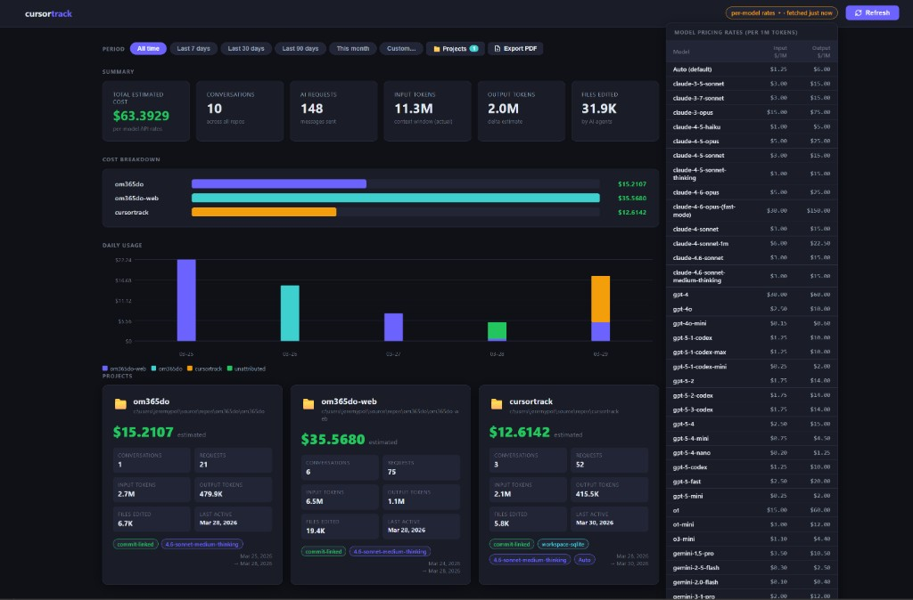

# cursortrack

> Track Cursor AI usage and **estimate cost per git repository** — built for freelancers and agencies who need to invoice clients for AI spend.

Cursor doesn't expose per-project costs. cursortrack reads Cursor's local SQLite databases, attributes every conversation to the git repo it belongs to, applies current model pricing, and presents everything in a live browser dashboard with PDF export.



---

## Features

- **Per-repo cost tracking** — every AI conversation attributed to its git repository via commit history, workspace databases, and chat context
- **Accurate token data** — input tokens read directly from Cursor's local SQLite; output tokens estimated via context-window delta method
- **Live dashboard** — dark-mode web UI with period filters, project visibility controls, cost breakdown chart, and daily usage chart
- **Auto-sync** — data re-imported every 15 minutes; model pricing fetched from cursor.com every 24 hours
- **PDF export** — print-ready cost report with KPIs, charts, and per-project detail cards; respects active filters
- **Persistent history** — conversations saved to a local SQLite database; data survives chat deletion in Cursor
- **Automatic pricing** — headless Chromium scrapes the Cursor pricing page and keeps `prices.json` up to date; historical costs are never retroactively changed

---

## Requirements

- **Python 3.10+**
- **Windows** (reads `%APPDATA%\Cursor` — macOS/Linux paths differ but the code can be adapted)
- **Cursor** installed and used at least once

---

## Installation

```powershell
git clone https://github.com/jeremypot/cursortrack.git
cd cursortrack
pip install -r requirements.txt
python -m playwright install chromium
```

`pip install -r requirements.txt` installs `playwright`. The second command downloads the Chromium browser binary (one-time, ~170 MB) — this step can't be automated via pip. Playwright is only used to scrape model pricing from cursor.com; everything else uses the Python standard library.

---

## Quick start

```powershell
python dashboard.py
```

Opens the dashboard at `http://localhost:8765`, runs an initial data sync, and starts auto-syncing in the background.

```powershell
python dashboard.py --no-refresh   # skip initial sync, show last cached data
python dashboard.py --port 9000    # use a different port
```

### Command-line only

```powershell
# Sync all data and write cursor-usage.json
python tracker.py

# Filter by date range
python tracker.py --last 30
python tracker.py --since 2026-01
python tracker.py --from 2026-01-01 --until 2026-03-31

# Update prices only (no data sync)
python tracker.py --prices-only
```

---

## Dashboard

| Feature | Description |
|---------|-------------|
| **Period filter** | All time · Last 7/30/90 days · This month · Custom date range |
| **Project filter** | Hide/show individual projects — persisted across sessions, excluded from all totals and charts |
| **Summary KPIs** | Total cost · Conversations · Requests · Input tokens · Output tokens · Files edited |
| **Cost breakdown** | Horizontal bar chart per repo |
| **Daily usage chart** | Stacked bar chart — cost per day per project |
| **Project cards** | Per-repo detail: cost, requests, models used, attribution method, date range |
| **Rates dropdown** | All current model rates, sync schedule, and Update Prices button |
| **Auto sync** | Data re-imported every 15 min · Prices re-fetched every 24 h |
| **Export PDF** | Print-ready report — summary, charts, and project cards; projects section starts on a new page |

---

## How it works

### Attribution

Every conversation is attributed to a git repository using three layers, checked in priority order:

| Priority | Source | What it covers |
|----------|--------|----------------|
| 1 — commit-linked | `~/.cursor/ai-tracking/ai-code-tracking.db` | Every file the agent touched → git root. Most accurate. |
| 2 — workspace-sqlite | `%APPDATA%\Cursor\User\workspaceStorage\*/state.vscdb` | Conversation ID → workspace folder → git root. Covers all single-folder workspaces. |
| 3 — bubble context | `%APPDATA%\Cursor\User\globalStorage\state.vscdb` | Files referenced in chat bubbles. Good fallback for pure-chat sessions. |

### Cost calculation

```
estimated_cost = (input_tokens  / 1,000,000 × input_rate)
               + (output_tokens / 1,000,000 × output_rate)
```

**Input tokens** are read directly from `contextWindowStatusAtCreation.tokensUsed` in Cursor's local SQLite — this is the exact context window size sent to the model.

**Output tokens** are estimated using the **delta method**: the growth in `tokensUsed` between consecutive requests within a conversation approximates what the model generated. Negative deltas (context-window compression) are discarded. Single-request sessions fall back to the flat `_avg_output_tokens` value in `prices.json` (default: 2000).

> The delta method includes thinking tokens for models like `claude-*-thinking`, which can inflate the output estimate. It is a conservative upper bound on true output cost.

### Pricing

Model rates are stored in `prices.json` and fetched automatically from [cursor.com/docs/models-and-pricing](https://cursor.com/docs/models-and-pricing) every 24 hours using a headless Chromium browser (Playwright). The "Show more models" button is clicked automatically to capture all models.

- Price changes apply only to conversations synced **after** the update — stored costs in `history.db` are never retroactively recalculated.
- `prices.json` can be edited manually to override any rate.
- The `_avg_output_tokens` key controls the flat output fallback for single-request sessions.

### Data persistence

All conversation data is written to `history.db` (local SQLite, gitignored). Syncs are incremental — a conversation is only re-written when its token counts have increased (i.e. new messages were added). Deleting a chat in Cursor does not affect `history.db`.

---

## Files

| File | Purpose |
|------|---------|
| `dashboard.py` | Local HTTP server + browser dashboard |
| `tracker.py` | Data sync engine and CLI report generator |
| `prices.json` | Model rates — auto-fetched; edit to override |
| `requirements.txt` | Python dependencies (`playwright`) |
| `history.db` | Conversation history (auto-generated, gitignored) |
| `cursor-usage.json` | Latest report snapshot (auto-generated, gitignored) |

---

## Why not use the Cursor API?

`cursor.com/api/usage` only tracks the legacy per-token `gpt-4` counter. For Ultra and other flat-rate plans it returns zeros — Cursor does not expose per-request token detail through any public API. cursortrack reads exclusively from local SQLite databases.

---

## Contributing

Pull requests welcome. A few notes:

- The project has no runtime dependencies beyond `playwright` for pricing scrapes — keep it that way.
- `tracker.py` is pure data; `dashboard.py` is pure presentation. Keep them separate.
- Pricing changes must never retroactively update stored costs (see `sync_to_history()` in `tracker.py`).

---

## License

MIT
